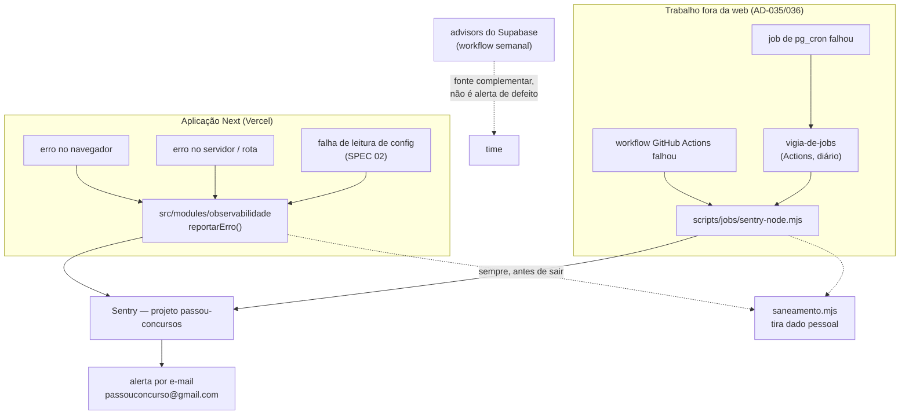

# SPEC 03 — Observabilidade e segredos · Design

**Spec**: `.specs/features/03-observabilidade-e-segredos/spec.md`
**Requisitos**: INFRA-09, INFRA-10 + a assumption "migrações aplicadas via GitHub Actions" (M9 §Assumptions)
**ADs que mandam aqui**: AD-037 (Sentry), AD-036 (job pesado em GitHub Actions), AD-035 (job leve em
pg_cron), AD-078/AD-081 (config e flags), AD-083 (Vitest `unit` + `db`, sem Docker), AD-085 (job lê
config fora de requisição), AD-076 (o que nasce ligado), AD-079 (nada de session replay)
**Status**: Approved

---

## Architecture Overview

Hoje o projeto tem **um** ponto de reporte de erro, e ele mora dentro do módulo de configuração
(`reportarFalhaDeConfig`, criado na SPEC 02). Ele cai no `console.error`. Esta spec tira esse ponto de
dentro do config, promove a módulo próprio do projeto e liga a ponta dele no Sentry — sem mudar a
assinatura que a SPEC 02 já publicou.

Três origens de erro, um destino:



**A regra de ouro do desenho:** o núcleo do reporte **não importa o Sentry**. Ele expõe um destino
injetável, e quem liga o Sentry é o ponto de entrada (o boot do Next, ou o boot do script de job).
Três razões:

1. O teste `unit` do AD-083 não pode tocar rede. Núcleo sem SDK = teste puro, sem mock de biblioteca.
2. A aplicação usa `@sentry/nextjs`; script de linha de comando usa `@sentry/node`. São dois pacotes
   diferentes para o mesmo destino — um núcleo neutro serve os dois sem ramificação.
3. A SPEC 02 já publicou `definirReporteDeErro()` como costura de teste. Manter a mesma forma um nível
   acima evita inventar um segundo padrão para a mesma coisa.

---

## Code Reuse Analysis

### O que já existe e é aproveitado

| Componente | Onde | Como é usado |
| --- | --- | --- |
| `definirReporteDeErro` / `reportarFalhaDeConfig` | `src/modules/config/leitura.ts:41-55` | assinatura **preservada**; só o corpo do padrão muda para delegar ao módulo novo |
| Catálogo de chaves | `src/modules/config/catalogo.ts` | ganha a 1ª chave do M9 (`flag.m9.rota_de_erro_proposital`) |
| `isFlagOn` | `src/modules/config/leitura.ts:182` | porteiro da rota de erro proposital |
| Job `segredos` da CI | `.github/workflows/ci.yml:9-46` | a varredura sai do YAML para um script testável e ganha padrões novos |
| `scripts/alvo-do-banco.mjs` | idem | padrão do projeto: script `.mjs` com JSDoc + teste `.ts` no projeto `unit` |
| `conferirAlvo()` | `scripts/alvo-do-banco.mjs:79` | o workflow de migração usa a mesma trava de "banco certo" |
| `tests/db/conexao.ts` | idem | o teste de banco da migração do pg_cron reusa a conexão |
| Padrão de migração append-only | `supabase/migrations/20260816212947_configuracoes.sql` | mesmo molde de comentário e de `security_invoker` na view |

### Integration Points

| Sistema | Como conecta |
| --- | --- |
| Sentry (SaaS, região EUA) | DSN por variável de ambiente; DSN vazio ⇒ SDK calado, app funciona igual |
| GitHub Actions | passo `if: failure()` em cada job chama o reporter; workflows novos: vigia, advisors, migração |
| pg_cron | extensão instalada aqui; view `public.jobs_falhados` sobre `cron.job_run_details` |
| Supabase Management API | `GET /v1/projects/{ref}/advisors/{security,performance}` com o PAT |

---

## Components

### `src/modules/observabilidade/saneamento.mjs`

- **Propósito**: tirar dado pessoal de qualquer coisa antes de sair do processo. É o mecanismo do
  contrato desta spec ("mensagem de erro SHALL NOT conter dado pessoal em texto claro", antecipa
  DADOS-07 AC6).
- **Por que `.mjs` e não `.ts`**: é o único pedaço que a aplicação **e** os scripts de job precisam.
  Script de job roda em Node cru; o Node desta máquina (22.17) ainda não lê TypeScript sozinho e o
  runner da CI (`node-version: 22`) leria — construir em cima dessa diferença é bug esperando. O
  projeto já tem o padrão pronto (`scripts/alvo-do-banco.mjs` + teste `.ts`), e o `tsconfig.json` já
  traz `allowJs: true`, então a aplicação TypeScript importa sem cerimônia.
- **Interfaces**:
  - `sanitizar(valor, profundidade?)` — devolve cópia com valor de chave sensível trocado por
    `"[removido]"`, e-mail trocado por `"[email]"` e CPF por `"[cpf]"`, em qualquer profundidade.
  - `sanearEventoSentry(evento)` — aplica `sanitizar` no evento inteiro e apaga `user.email`,
    `user.ip_address`.
  - `CHAVES_SENSIVEIS` — a lista, exportada para o teste conferir.
- **Dependências**: nenhuma. Função pura.

### `src/modules/observabilidade/reporte.ts`

- **Propósito**: o ponto único de reporte do projeto inteiro.
- **Interfaces**:
  - `reportarErro(erro, contexto)` — saneia e entrega ao destino atual.
  - `definirDestinoDeErro(destino)` / `restaurarDestinoPadrao()` — costura; o boot liga o Sentry aqui.
  - `DestinoDeErro = (erro, contexto) => void`
- **Destino padrão**: `console.error`. É o que vale em teste, em `npm run dev` e em qualquer processo
  que não tenha ligado o Sentry — a queda é silenciosa para o Sentry, **nunca** para o log.

### `src/modules/observabilidade/ambiente.ts`

- **Propósito**: decidir DSN, release e ambiente a partir de variável de ambiente, com regras
  testáveis, para os três `Sentry.init` não repetirem lógica.
- **Interfaces**: `dsn()`, `release()`, `ambienteDeExecucao()`, `sentryLigado()`.
- **Regra do release**: `NEXT_PUBLIC_SENTRY_RELEASE` → `VERCEL_GIT_COMMIT_SHA` → `GITHUB_SHA` →
  `"desenvolvimento"`. Nunca lança; sem nada, devolve o literal.

### `src/instrumentation.ts` · `src/instrumentation-client.ts` · `src/sentry.*.config.ts`

- **Propósito**: ligar o SDK nos três lugares onde o Next executa código (Node, Edge, navegador).
- `instrumentation.ts` exporta `onRequestError = Sentry.captureRequestError` — é **isto** que carrega
  o contexto de rota do AC1 (`routerKind`, `routePath`, `routeType`) para erro de Server Component,
  de rota e de middleware.
- Cada `Sentry.init` recebe `beforeSend: sanearEventoSentry` e chama `definirDestinoDeErro`, ligando
  a ponta do núcleo.

### `src/app/global-error.tsx`

- **Propósito**: erro de renderização do React no App Router não passa pelo `onRequestError`; só o
  `global-error` alcança. Sem ele o AC1 fica com um buraco no front.

### `src/app/api/erro-proposital/route.ts`

- **Propósito**: o Success Criteria nº1 da spec é "erro proposital numa rota aparece no Sentry com
  alerta". Sem uma rota que erre de propósito, isso vira teste manual improvisado toda vez.
- **Porteiro**: `flag.m9.rota_de_erro_proposital`, **default `false`**. Flag desligada ⇒ `404`. É a
  primeira chave do M9 no catálogo e prova o mecanismo da SPEC 02 com um dono real.

### `scripts/jobs/sentry-node.mjs`

- **Propósito**: `Sentry.init` para processo fora do Next (GitHub Actions), com o mesmo
  `beforeSend: sanearEventoSentry`.
- **Interfaces**: `iniciarSentry()`, `reportar(erro, contexto)`, `encerrar()` (flush antes do
  `process.exit` — sem flush o processo morre com o evento na fila).

### `scripts/jobs/reportar-falha.mjs`

- **Propósito**: CLI chamado pelo passo `if: failure()` de cada job. Recebe o nome do workflow, do
  job e a URL da execução, e manda um evento. Só metadado público do GitHub — nenhum dado de aluno.

### `scripts/jobs/vigia-de-jobs.mjs` + `public.jobs_falhados`

- **Propósito**: pg_cron falha **dentro** do banco e não avisa ninguém. O pg_cron grava toda execução
  em `cron.job_run_details`; a view expõe as que falharam na janela, e o vigia lê e reporta.
- **Janela**: constante em código, **26 horas** (execução diária + 2h de folga). **Não** vai para a
  tabela de configuração, pela mesma razão que a janela de cache do AD-081 não foi: config ilegível é
  uma das falhas que o vigia existe para denunciar — se ele dependesse da config para ligar, calaria
  exatamente quando importa.

### `scripts/advisors.mjs`

- **Propósito**: INFRA-09 AC3 — advisors como fonte complementar. Chama a Management API, imprime os
  achados e **reprova** quando houver `ERROR`; `WARN`/`INFO` só aparecem.
- **Aviso registrado**: o endpoint é marcado **experimental** pela Supabase. O script trata resposta
  inesperada como falha explícita, não como "tudo certo".

### `scripts/varredura-de-segredos.mjs`

- **Propósito**: a varredura da SPEC 01 mora dentro do YAML e não tem teste. Vira script com teste, e
  o YAML passa a chamá-lo. Ganha os padrões que esta spec introduz (`sntrys_`, `sb_secret_`, string
  de conexão Postgres com senha).

---

## Data Models

### View `public.jobs_falhados`

```sql
create view public.jobs_falhados with (security_invoker = true) as
select jobid, runid, jobname, status, return_message, start_time, end_time
from cron.job_run_details
where status in ('failed', 'canceled');
```

`security_invoker` porque `anon`/`authenticated` não têm acesso ao schema `cron` — a view não abre
porta lateral. O vigia lê pela conexão direta (`DATABASE_URL`), não por PostREST.

### Chave nova no catálogo

| Chave | Tipo | Default | Dono | Para quê |
| --- | --- | --- | --- | --- |
| `flag.m9.rota_de_erro_proposital` | boolean | `false` | m9 | libera `/api/erro-proposital` para conferir o caminho até o Sentry |

### Variáveis de ambiente novas (INFRA-10)

| Variável | Segredo? | Onde vive | Quem usa |
| --- | --- | --- | --- |
| `NEXT_PUBLIC_SENTRY_DSN` | **não** (vai para o navegador por desenho) | `.env` local · env da Vercel · GitHub Secrets | os três `Sentry.init` |
| `SENTRY_AUTH_TOKEN` | **sim** | GitHub Secrets · env da Vercel | upload de source map no build |
| `NEXT_PUBLIC_SENTRY_RELEASE` | não | build | identificar a versão |

---

## Error Handling Strategy

| Cenário | Tratamento | Impacto no aluno |
| --- | --- | --- |
| DSN vazio (dev, clone sem credencial) | SDK não transmite nada; `reportarErro` cai no `console.error` | nenhum — app funciona igual |
| Sentry fora do ar / bloqueado | SDK engole e enfileira; nada propaga para a rota | nenhum |
| `reportarErro` recebe contexto com e-mail | saneado antes de sair do processo | nenhum |
| Falha ao ler config | continua caindo no default e com a flag desligada (SPEC 02) **e agora alerta** | nenhum |
| Job de Actions falha | passo `if: failure()` reporta + o workflow fica vermelho | nenhum |
| pg_cron falha | linha em `jobs_falhados`; vigia reporta em até 24h | atraso do plano do dia, visível |
| Vigia não consegue conectar no banco | sai com código ≠ 0 ⇒ workflow vermelho ⇒ reporte pelo passo `if: failure()` | nenhum |
| Advisors devolvem formato inesperado | falha explícita, nunca "nenhum achado" | nenhum |

---

## Risks & Concerns

| Concern | Onde | Impacto | Mitigação |
| --- | --- | --- | --- |
| **Sentry na região EUA** — o DSN entregue é `ingest.us.sentry.io`. É transferência internacional de dado, art. 33 LGPD, sem decisão de adequação da ANPD; o mesmo item que a AD-079 abriu para o PostHog | conta Sentry | agrava a pendência jurídica; mudar de região depois exige organização nova | (a) o saneamento tira dado pessoal **na origem**, que é a defesa real; (b) `dataCollection` desliga IP e corpo de requisição; (c) registrado na AD nova e na lista do advogado; (d) enquanto não houver evento gravado, trocar para a UE é só trocar o DSN |
| **Session replay do Sentry** — o SDK oferece; grava a tela | `Sentry.init` | contraria DADOS-07 AC6 pela mesma razão que a AD-079 usou contra o PostHog | não é ligado em lugar nenhum, e a AD nova registra a proibição para não voltar por descuido |
| **Endpoint de advisors é experimental** (a própria doc diz) | `scripts/advisors.mjs` | pode sumir sem aviso | script falha explícito em resposta inesperada; o painel do Supabase continua sendo o caminho manual |
| **Minutos de GitHub Actions** — repositório privado tem cota mensal | workflows novos | vigia de hora em hora comeria a cota | vigia **diário** + `workflow_dispatch`; advisors **semanal**; migração só em push na `main` que toque `supabase/migrations/**` |
| **Varredura de segredos hoje não tem teste** e mora no YAML | `.github/workflows/ci.yml:18-37` | regra pode quebrar sem ninguém ver | vira script com teste unitário; o YAML só chama |
| **`main` é o único ambiente** — não há staging (INFRA-07 é da SPEC 16) | workflow de migração | migração ruim vai direto ao banco de desenvolvimento | a trava `conferirAlvo()` já recusa banco errado; migração roda **depois** do CI verde; risco aceito e registrado, some na SPEC 16 |
| **`pg_cron` não estava instalado** e o roadmap cita pg_cron na SPEC 06 | migração | parecer dependência para frente | **não é**: a SPEC 03 instala a extensão e constrói a vigilância; a SPEC 06 cria o primeiro job de verdade. Sem a extensão, o Success Criteria "pg_cron forçado a falhar dispara alerta" é impossível de cumprir |

---

## Tech Decisions

| Decisão | Escolha | Racional |
| --- | --- | --- |
| Onde o alerta chega | e-mail `passouconcurso@gmail.com`, pela regra padrão do Sentry | resolve a assumption em aberto da spec; zero integração a manter. Discord/Slack fica para quando houver time |
| Núcleo do reporte importa o Sentry? | **não** | teste `unit` sem rede (AD-083); app e script usam SDKs diferentes |
| Tracing / performance | **desligado** (`tracesSampleRate: 0`) | AD-037 pediu erro, não desempenho; span consome cota do plano gratuito sem responder pergunta nenhuma hoje |
| Session replay | **proibido** | mesma razão da AD-079 |
| `sendDefaultPii` × `dataCollection` | `dataCollection: { userInfo: false, httpBodies: [] }` | conferido no Context7 em 2026-08-16: `sendDefaultPii` está depreciado desde a 10.54.0 e some na v11 |
| Numeração das tasks | **T23–T32** | T1–T9 são das SPECs 01/02, T10 morreu e T11–T22 estão reservadas às SPECs 05/06/07 (Handoff). Recomeçar em T1 colidiria com o histórico |
| Janela do vigia | constante em código (26h) | mesma exceção declarada da janela de cache no AD-081: quem vigia a config não pode depender dela |
| Migração por CI | `push` na `main` tocando `supabase/migrations/**` | atende a assumption do M9 sem inventar ambiente que a SPEC 16 vai criar |

> **Decisões de nível de projeto** deste Design viram AD nova no `STATE.md`: canal do alerta, ponto
> único de reporte, proibição do replay, região EUA do Sentry e a fronteira pg_cron 03 × 06.

---

## Requirement Traceability

| Requisito / AC | Onde é atendido |
| --- | --- |
| INFRA-09 AC1 (erro front+servidor no Sentry, com rota e release, e alerta) | T24 (SDK, release), T26 (prova ponta a ponta), regra de e-mail |
| INFRA-09 AC2 (falha de job visível e alertada) | T27 (Actions), T28 (view do pg_cron), T29 (vigia) |
| INFRA-09 AC3 (advisors como fonte complementar) | T30 |
| INFRA-10 (segredo fora do código, `.env.example` sem valor, CI reprova) | T31 (inventário + varredura), T24 (`.env.example`) |
| M9 §Assumptions (migração por GitHub Actions, prod exige merge) | T32 |
| Contrato desta spec (erro sem dado pessoal) | T23 (saneamento), aplicado em T24 e T27 |
| Contrato desta spec (todo job novo entrega falha visível) | T27 + T29 dão o mecanismo pronto para as specs seguintes |
