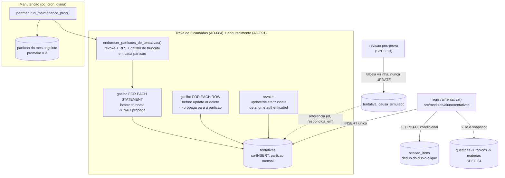

# SPEC 05 — Log de tentativas · Design

**Spec**: `.specs/features/05-log-de-tentativas/spec.md`
**Ritual**: **A** — design próprio + `tasks.md` + `validation.md` + Verificador independente completo
com sensor de mutação (AD-090).
**Rodada**: 2 — este documento **não refaz** `.specs/modulos/m4-coluna-vertebral/design.md`; ele
corrige e completa o que aquele documento deixou aberto.

---

## O que muda em relação ao design da rodada 1

O SQL de `tentativas`, das sessões e da causa do simulado continua valendo como está lá. Quatro
pontos mudam, e três deles saíram de **medição no banco de dev**, não de leitura de documentação.

| # | Rodada 1 dizia | Rodada 2 diz | Origem |
| --- | --- | --- | --- |
| 1 | Trava de **2 camadas** (`REVOKE` + gatilho de linha) | **3 camadas** — entra o gatilho `before truncate for each statement` | AD-084 (já registrado) |
| 2 | "a confirmar: gatilho de linha propaga para as partições?" | **Propaga.** Medido: o clone aparece em `pg_trigger` na partição e bloqueia UPDATE/DELETE também quando a partição é atacada direto | medição |
| 3 | (não previsto) | **O gatilho de TRUNCATE não propaga**, e partição nova **não herda RLS nem privilégios** do pai. Sem tratamento, toda partição criada pelo `pg_partman` nasce sendo uma cópia de `tentativas` legível e truncável por `authenticated` | medição → **AD-091** |
| 4 | `create_parent(...)` com a assinatura do partman 4 | assinatura do **pg_partman 5.3.1** (é a versão disponível no projeto), com `p_jobmon := false` | inspeção de `pg_get_function_arguments` |

### A medição do ponto 2 e 3, em uma tabela

Ensaio numa tabela particionada descartável, com os dois gatilhos criados **só no pai**:

| Ataque | Resultado |
| --- | --- |
| `update` via pai | bloqueado |
| `update` direto na partição | bloqueado |
| `delete` via pai | bloqueado |
| `delete` direto na partição | bloqueado |
| `truncate` via pai | bloqueado |
| **`truncate` direto na partição** | **PASSOU** |

E, num segundo ensaio, com a partição endurecida (`revoke all` de `anon`/`authenticated` +
`enable row level security` na própria partição):

| Operação | Resultado |
| --- | --- |
| `insert` via pai, como `authenticated` dono da linha | passa |
| `select` via pai, como `authenticated` dono da linha | passa, devolve só a própria linha |
| `select` direto na partição, como outro aluno | `permission denied` |

É o que fecha o desenho: **o privilégio é checado na tabela-pai**, então revogar tudo na partição não
atrapalha ninguém que passe pela porta da frente, e fecha a porta dos fundos.

---

## Architecture Overview

Esta spec entrega **a camada 1 inteira** do M4 (o fato cru) e nada da camada 2 (projeções, SPEC 06).



**A regra que organiza:** o único caminho de escrita é o INSERT. Correção é linha nova
(`tentativas`) ou tabela vizinha (`tentativa_causa_simulado`). A única exceção de DELETE é a porta
nomeada do esquecimento, e ela exige que a sessão diga **de quem** é o dado.

---

## Code Reuse Analysis

| O que já existe | Onde | Como esta spec usa |
| --- | --- | --- |
| `questoes (id, questao_versao)`, PK do par | `supabase/migrations/20260817113000_acervo_questoes.sql` | alvo da FK de `tentativas` — o banco impede que a versão respondida suma |
| `topicos` → `materias` | `..._acervo_taxonomia.sql` | fonte do snapshot (id **e** rótulo), lido por join no momento do INSERT |
| Enums `tipo_questao`, `origem_questao` | idem | tipos das colunas de snapshot — **não** se cria enum novo para isso |
| Molde da trava append-only | `..._configuracoes.sql` (3 camadas, `set search_path = ''`) | copiado, com a diferença de existir aqui a porta de esquecimento |
| `pg_cron` instalado | `..._pg_cron_e_jobs_falhados.sql` | agenda a manutenção do partman; a view `jobs_falhados` já torna a falha visível |
| `comBanco` / `comTransacaoRevertida` | `tests/db/conexao.ts` | todo teste de banco roda em transação revertida — obrigatório aqui, porque a tabela recusa DELETE |
| `inserirQuestao`, `criarTopico`, `criarProva` | `tests/db/acervo.ts` | fixtures reusadas; esta spec acrescenta `tests/db/aluno.ts` |
| `clienteDeServico()` | `src/lib/db/servidor.ts` | conexão de `registrarTentativa` |

**Nenhuma chave de configuração nova.** Nada nesta spec tem número calibrável: o que existe é
schema, trava e um INSERT. As chaves `param.m4.*` entram na SPEC 06, junto do motor que as lê —
declarar agora produziria chave órfã, que reprova no teste da SPEC 02.

**Nenhuma feature flag nova.** Não há superfície: a flag da sessão de questões é da SPEC 13.

---

## Data Models

### Enums do log

```sql
create type public.contexto_tentativa as enum
  ('diagnostico', 'plano', 'treino', 'simulado', 'revisao');

create type public.causa_erro as enum
  ('nao_sabia_conteudo', 'errei_a_conta', 'entendi_errado_enunciado',
   'confundi_conceitos', 'fiquei_na_duvida', 'chutei', 'nao_sei_dizer',
   'faltou_tempo');

create type public.causa_origem as enum ('aluno', 'sistema');
```

A ordem e os valores são os do **AD-043** / ALUNO-04 AC2, literais. `faltou_tempo` está no enum mas é
**recusado em `tentativas`** por `CHECK`: ele só existe na tabela vizinha do simulado.

### `tentativas`

O SQL da rodada 1 (`m4/design.md` §Data Models) vale, com **três acréscimos**:

1. **FK para `questoes (id, questao_versao)`.** O contrato vigente nº1 do `STATE.md` manda, e a PK do
   par existe desde a SPEC 04. Sem a FK a tentativa poderia apontar para versão que nunca existiu.
   `on delete restrict` explícito: `questoes` não é apagável, e se um dia for, o log ganha voz.
2. **FK para `topicos` e `materias`** apenas nos `*_id`. O **rótulo** é cópia, e é ele que congela: a
   FK garante que o id aponta para algo real, e a coluna de texto garante que reclassificar não
   desloca o histórico. As duas coisas juntas, não uma no lugar da outra.
3. `user_id` **sem FK para `auth.users`**. Deliberado: a SPEC 07 é quem cria a identidade do aluno
   (`matricula`), e uma FK para `auth.users` com `on delete cascade` seria uma **segunda porta de
   DELETE** em `tentativas`, contradizendo a porta nomeada do AD-029. O apagamento passa pela porta,
   sempre.

### A trava, em 3 camadas + o endurecimento das partições

```sql
-- camada 1 — a aplicacao nao tem o privilegio
revoke update, delete, truncate on public.tentativas from anon, authenticated;

-- camada 2 — pega tambem o service_role (rolbypassrls). Propaga para as particoes.
create trigger tentativas_sem_mutacao
  before update or delete on public.tentativas
  for each row execute function public.tentativas_bloqueia_mutacao();

-- camada 3 — TRUNCATE nao dispara gatilho de linha. NAO propaga: ver AD-091.
create trigger tentativas_sem_truncate
  before truncate on public.tentativas
  for each statement execute function public.tentativas_bloqueia_truncate();
```

A função de linha é a que carrega a **porta do esquecimento**:

```sql
create or replace function public.tentativas_bloqueia_mutacao()
returns trigger language plpgsql set search_path = '' as $$
begin
  if tg_op = 'UPDATE' then
    raise exception 'tentativas e log imutavel: UPDATE proibido (AD-015/AD-042)';
  end if;
  if current_setting('app.esquecimento_user_id', true) is distinct from old.user_id::text then
    raise exception 'DELETE em tentativas so pela rotina de esquecimento (AD-029)';
  end if;
  return old;
end;
$$;
```

`current_setting(..., true)` devolve NULL quando a chave não foi definida, e `is distinct from` faz o
NULL perder — sessão que não declarou nada não apaga nada.

### `endurecer_particoes_de_tentativas()` — a peça nova (AD-091)

```sql
create or replace function public.endurecer_particoes_de_tentativas()
returns integer language plpgsql security definer set search_path = '' as $$
-- para cada particao de public.tentativas:
--   revoke all ... from anon, authenticated
--   alter table ... enable row level security      (sem policy = invisivel direto)
--   create trigger <nome>_sem_truncate before truncate ... (se ainda nao existir)
-- devolve quantas particoes foram endurecidas.
$$;
```

Idempotente por construção: revogar o que já está revogado e ligar RLS já ligada não são erro, e o
gatilho só é criado quando falta. Chamada em **dois** lugares:

- no fim da migração do particionamento, para as partições que o `create_parent` acabou de criar;
- no job de manutenção, **imediatamente depois** de `partman.run_maintenance_proc()`, que é o único
  momento em que partição nova nasce.

`security definer` porque quem roda o job pelo `pg_cron` precisa poder alterar tabela do `postgres`.

### `pg_partman` — a chamada real (5.3.1)

```sql
create schema if not exists partman;
create extension if not exists pg_partman with schema partman;

select partman.create_parent(
  p_parent_table  := 'public.tentativas',
  p_control       := 'respondida_em',
  p_interval      := '1 month',
  p_type          := 'range',
  p_premake       := 3,
  p_default_table := true,
  p_jobmon        := false
);

update partman.part_config
   set retention           = null,      -- AD-067: particao NUNCA e dropada
       retention_keep_table = true,
       inherit_privileges   = true      -- 1a linha de defesa do AD-091
 where parent_table = 'public.tentativas';
```

- `p_type := 'range'` — no partman 5 os valores viraram `range`/`list`; `native` não existe mais.
- `p_jobmon := false` — `pg_jobmon` não está instalado; deixar `true` só produz aviso.
- `p_default_table := true` — sem partição *default*, um INSERT com data fora das faixas criadas
  **falha**, e o edge case do M9 pede que falha de manutenção vire alerta, não INSERT perdido.
  Medido: a partição default **não** estraga o pruning (`EXPLAIN` continua podando para uma só).
- `inherit_privileges := true` faz o partman copiar os privilégios do pai para o filho; o
  endurecimento acrescenta a RLS e o gatilho, que o partman não copia.

### Manutenção em `pg_cron`

```sql
select cron.schedule('tentativas-manutencao-particao', '17 5 * * *', $$
  call partman.run_maintenance_proc();
  select public.endurecer_particoes_de_tentativas();
$$);
```

Diário, 05:17 UTC (02:17 BRT), fora do horário dos jobs da SPEC 06. Diário e não mensal de propósito:
com `premake = 3` há três meses de folga, então uma execução perdida é um alerta em
`public.jobs_falhados` (SPEC 03), não uma perda de INSERT — que é exatamente o que o edge case do
INFRA-04 pede.

### Sessão, itens e causa do simulado

Como na rodada 1, com dois ajustes:

- `sessoes.plano_dia_id` **sai** — `plano_dia` é da SPEC 06, e depender dela seria dependência para
  frente (proibida pelo ROADMAP). A coluna entra na SPEC 06, junto da tabela que ela referencia.
- `sessao_itens` ganha `unique (sessao_id, questao_id)` além de `unique (sessao_id, ordem)`: a mesma
  questão duas vezes na mesma sessão é erro de montagem, e o dedup fica mais honesto.

`tentativa_causa_simulado` referencia `tentativas (id, respondida_em)` por FK — a chave de partição
faz parte da PK, então a referência precisa dos dois campos.

---

## Components

### `registrarTentativa`

- **Purpose**: gravar uma resposta como linha permanente, com snapshot congelado e dedup.
- **Location**: `src/modules/aluno/tentativas/registrar.ts`, público por
  `src/modules/aluno/tentativas/index.ts`
- **Interface**:
  ```ts
  registrarTentativa(entrada: EntradaTentativa): Promise<ResultadoTentativa>
  ```
  onde `ResultadoTentativa` diz se a linha foi criada agora ou já existia (`duplicada: boolean`) —
  quem chama precisa saber, porque a tela do duplo-clique não pode mostrar "resposta registrada" duas
  vezes.
- **Ordem das operações** (a ordem é a regra, não detalhe):
  1. **Valida em memória** — contexto, letra compatível com o tipo, causa obrigatória no treino,
     causa só com erro, `faltou_tempo` recusado. Erro aqui é `TentativaRecusada`, com `motivo`
     nomeado, e **nenhuma ida ao banco**. É o que cumpre "recusado **antes** do INSERT" (ALUNO-03
     AC1).
  2. **Dedup** — `update sessao_itens set respondido_em = now() where id = $1 and respondido_em is
     null returning *`. Zero linhas ⇒ já foi respondida: busca a tentativa existente e devolve com
     `duplicada: true`, **sem** inserir.
  3. **Snapshot** — um `select` de `questoes` ⋈ `topicos` ⋈ `materias` ⋈ `provas`, pela versão
     **vigente**, trazendo id e rótulo de matéria e tópico, banca, tipo, dificuldade e origem.
  4. **INSERT** — uma instrução, com a causa dentro dela.
- **Por que o dedup não é `UNIQUE`**: constraint única em tabela particionada tem de incluir a chave
  de partição, e `(sessao_id, questao_id, respondida_em)` deixaria passar dois cliques com
  milissegundos de diferença. O `UPDATE ... where respondido_em is null` é atômico e não depende de
  índice nenhum.
- **Transação**: passos 2–4 numa transação só. Se o INSERT falhar, o `respondido_em` volta atrás e o
  aluno pode responder de novo — senão o duplo-clique de uma tentativa **falha** deixaria o item
  marcado como respondido para sempre.

### `tests/db/aluno.ts`

Fixtures desta spec: `criarSessao`, `criarItemDeSessao`, `inserirTentativa` com defaults válidos no
mesmo molde de `tests/db/acervo.ts` — cada teste sobrescreve só o campo que quer provar, para que a
razão de a linha ser recusada seja sempre a que o teste diz.

---

## Classificação LGPD (declaração, não implementação)

O ROADMAP exige que toda spec que cria tabela com `user_id` declare o grupo. **Grupo 1 (dado
identificado)**: `tentativas`, `sessoes`, `tentativa_causa_simulado`. `sessao_itens` não tem
`user_id` — some por `on delete cascade` de `sessoes`.

A **classificação formal no schema** e a **auditoria** são da SPEC 16, e a **rotina de apagamento** é
da SPEC 14 — as duas estão no `Out of Scope` desta spec. O que esta spec entrega, e é o que a SPEC 14
vai usar, é a **porta**: `set local app.esquecimento_user_id = '<uuid>'` seguido de `delete from
public.tentativas where user_id = '<uuid>'`. O teste dessa porta é desta spec, com os três casos
(sem declarar, declarando outro aluno, declarando o certo).

---

## Error Handling Strategy

| Cenário | Camada que pega | O que acontece |
| --- | --- | --- |
| Erro no treino sem causa | `registrarTentativa`, em memória | `TentativaRecusada('causa_obrigatoria')`, sem ida ao banco |
| Erro no treino sem causa, vindo por SQL direto | `CHECK causa_obrigatoria_no_treino` | INSERT recusado — a rede embaixo do módulo |
| Letra fora do tipo da questão | módulo, depois `CHECK resposta_valida` | recusado nas duas |
| `faltou_tempo` em `tentativas` | módulo, depois `CHECK faltou_tempo_so_no_simulado` | recusado; o valor só entra na tabela vizinha |
| Causa em resposta certa | `CHECK causa_so_com_erro` | recusado |
| Duplo-clique | `UPDATE` condicional em `sessao_itens` | devolve a tentativa existente, `duplicada: true` |
| INSERT falha depois do dedup | transação | `respondido_em` volta a nulo; o aluno responde de novo |
| UPDATE por script com chave de serviço | gatilho de linha | exceção nomeando AD-015/AD-042 |
| `truncate` na tabela ou em qualquer partição | gatilhos de statement (pai + cada partição) | exceção |
| Leitura direta de uma partição pelo navegador | `revoke all` + RLS na partição | `permission denied` |
| Manutenção do partman não roda | `premake = 3` + `public.jobs_falhados` | três meses de folga e alerta; nenhum INSERT perdido |
| INSERT com data fora de toda faixa | partição *default* | a linha entra; nada se perde |

---

## Risks & Concerns

| Concern | Impacto | Mitigação |
| --- | --- | --- |
| **Partição nova nascer desprotegida** entre a criação e a próxima manutenção | janela em que `authenticated` lê o log de todo mundo direto na partição | `inherit_privileges = true` já entrega o `revoke` no momento da criação; o job fecha RLS e gatilho no mesmo dia. **A janela é o preço de o partman não clonar RLS** — registrado na AD-091, e a SPEC 16 pode fechá-la com event trigger se o risco crescer |
| `endurecer_particoes_de_tentativas()` é `security definer` | função privilegiada | corpo fechado: só `revoke`/`enable rls`/`create trigger`, só em partições de `public.tentativas`, `set search_path = ''`, nome de objeto passado por `format(%I)` |
| Teste de banco roda em transação revertida, e `create_parent` não | teste de particionamento não pode ser revertido | os testes de partição **leem** o que a migração criou (`pg_class`, `part_config`, `EXPLAIN`), não criam partição |
| `EXPLAIN` em tabela vazia não prova índice | falso positivo | armadilha nº4 do `STATE.md`: `enable_seqscan = off` e afirmação sobre *quais partições aparecem no plano*, que é o que o INFRA-04 AC2 pede — não sobre nome de índice |
| FK de `tentativas` para `questoes` encarece o INSERT | latência na sessão | uma verificação de índice único por resposta; o ganho (não existir tentativa órfã na fundação do produto) paga |
| `user_id` sem FK aceita uuid inexistente | linha órfã de aluno que nunca existiu | RLS `with check (user_id = auth.uid())` fecha o caminho do aluno; o caminho de serviço é script nosso. A alternativa (FK com cascade) abriria uma 2ª porta de DELETE, que é pior |

---

## Tech Decisions

| Decisão | Escolha | Racional |
| --- | --- | --- |
| Endurecimento das partições | função idempotente chamada pela migração e pelo job | partman não clona RLS nem gatilho, e partição em `public` é exposta pelo PostgREST → **AD-091** |
| Partição *default* | ligada | INSERT nunca se perde; medido que não estraga o pruning |
| Retenção do partman | desligada, `retention_keep_table = true` | AD-067 — partição nunca é dropada |
| Frequência da manutenção | diária | com `premake = 3`, torna a falha um alerta em vez de uma perda |
| `plano_dia_id` em `sessoes` | **adiado para a SPEC 06** | depender de tabela de spec maior é dependência para frente |
| Dedup | `UPDATE` condicional em `sessao_itens` | `UNIQUE` em tabela particionada exigiria a chave de partição e não pegaria dois cliques |
| Validação em memória antes do INSERT | sim, com `CHECK` como rede | ALUNO-03 AC1 pede recusa **antes** do INSERT, com mensagem própria |
| FK de `user_id` | não existe | evita segunda porta de DELETE (AD-029) |

> **AD nova desta rodada:** **AD-091** — endurecimento de partição em tabela append-only. Registrada
> em `.specs/STATE.md`.

---

## Requirement Traceability

| Requisito | AC | Onde é atendido |
| --- | --- | --- |
| ALUNO-01 | AC1 (só-INSERT) | trava de 3 camadas + endurecimento das partições |
| ALUNO-01 | AC2 (snapshot) | colunas de snapshot + `registrarTentativa` passo 3 |
| ALUNO-01 | AC3 (reclassificar não desloca) | rótulo é cópia; teste reclassifica o tópico e compara |
| ALUNO-01 | AC4 (contexto no conjunto) | enum `contexto_tentativa` |
| ALUNO-01 | AC5 (particionada, recalculável) | `pg_partman` + o log ser a única fonte |
| ALUNO-03 | AC1 (causa no próprio INSERT) | validação em memória + `CHECK causa_obrigatoria_no_treino` |
| ALUNO-03 | AC2 (as 6 + não sei) | enum `causa_erro` |
| ALUNO-03 | AC4 (`nao_sei_dizer` válido) | é valor do enum, aceito sem tratamento especial |
| ALUNO-04 | AC2 (lista de causas) | enum `causa_erro` com `faltou_tempo` |
| ALUNO-04 | AC3 (simulado em tabela vizinha) | `tentativa_causa_simulado` + `CHECK faltou_tempo_so_no_simulado` |
| INFRA-04 | AC1 (mensal, futura pré-criada) | `create_parent` com `p_premake := 3` |
| INFRA-04 | AC2 (pruning) | `EXPLAIN` com `enable_seqscan = off` |
| INFRA-04 | AC3 (manutenção automática) | job `pg_cron` diário |
| INFRA-04 | AC4 (índices desde a 1ª migração) | os 4 índices na migração da tabela |
| ALUNO-04 AC1/AC5, ALUNO-03 AC3/AC5 | — | **fora desta spec**: tela é SPEC 13, remédio no plano é SPEC 06 |
