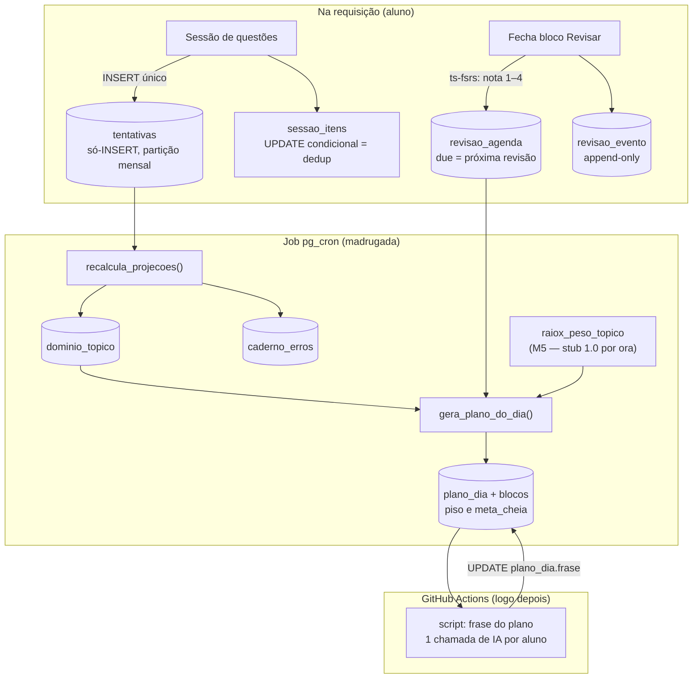

# M4 — Coluna Vertebral do Aluno · Design

**Spec**: `.specs/modulos/m4-coluna-vertebral/spec.md`
**Status**: Draft
**Depende de**: `.specs/modulos/m9-infra/design.md` (INFRA-11, configuração; INFRA-04, partição)

---

## Architecture Overview

Três camadas, e a fronteira entre elas é o que este módulo protege:

1. **Fato cru** — `tentativas`. Só-INSERT, com snapshot congelado. Nada aqui muda depois de escrito.
2. **Projeção** — `dominio_topico`, `caderno_erros`, `revisao_agenda`. Tudo reconstruível a partir
   da camada 1. Se apagar inteira e rodar o job, os mesmos números voltam.
3. **Plano** — `plano_dia` e seus blocos. Saída do motor de prioridade, escrito por regra/SQL.



**A regra que organiza tudo:** o aluno escreve na camada 1; o job escreve nas camadas 2 e 3; a IA
escreve **uma frase** e nada mais. Nenhuma decisão de o que estudar sai de um modelo.

### O impasse do FSRS, e por que não é um

O INFRA-03 manda job leve rodar em `pg_cron`, dentro do Postgres. O FSRS é biblioteca TypeScript
(`ts-fsrs`) e não existe em plpgsql. Parece obrigar a escolher entre violar a infra ou reimplementar
o algoritmo em SQL — as duas ruins.

Não é preciso escolher, porque o **ALUNO-09 AC3** já definiu o contrato: o que o motor de prioridade
consome é *"este tópico está devendo revisão ou não"*. Então:

- O FSRS roda **no momento em que o aluno fecha um bloco Revisar** — 1 aluno × 1 tópico, dentro da
  requisição, em milissegundos. Grava `due` (a data da próxima revisão).
- O job da madrugada, em SQL puro, só compara `due <= hoje`.

O algoritmo fica em TypeScript, onde a biblioteca vive e onde dá para testar; o job fica em SQL,
como a infra manda. Trocar FSRS pela régua fixa (plano B do AC4) troca **quem calcula o `due`** e
mais nada — o job não sabe qual algoritmo produziu a data.

---

## Code Reuse Analysis

Primeira feature de aplicação do projeto: não há código a reusar. O que se herda são **contratos já
fechados** — e respeitá-los é o trabalho:

| Contrato | Origem | O que o M4 herda |
| --- | --- | --- |
| `questao_id` + `questao_versao` | AD-039 (M1) | a tentativa aponta para a versão respondida e nunca se desloca |
| `tipo_questao`, `origem`, `dificuldade` | AD-039/AD-040 (M1) | valores do snapshot congelado |
| Configuração e flags | AD-078/AD-081 (M9) | todo número deste módulo mora lá |
| Partição mensal | INFRA-04 | `tentativas` nasce particionada |
| `piso` / `meta_cheia` | AD-044 | contrato que o M6 consome |
| peso "quanto cai" | AD-056/AD-057 (M5) | lido por view; **stub 1.0** enquanto o M5 não existe |

| Biblioteca | Uso | Verificado |
| --- | --- | --- |
| `ts-fsrs` | `fsrs()`, `createEmptyCard()`, `scheduler.next(card, data, Rating)` | Context7, 2026-08-16 — os pesos padrão funcionam sem histórico (AD-072) |
| `@open-spaced-repetition/binding` | `computeParameters` — **fast-follow**, não entra agora | Context7, 2026-08-16 — pacote separado |

---

## Components

### Estrutura de pastas (primeira decisão de código do projeto)

```
src/
  app/                          rotas (App Router)
  modules/
    config/                     INFRA-11
    aluno/
      tentativas/               registro do fato cru
      revisao/                  FSRS e régua fixa
      projecoes/                leitura das projeções
      plano/                    leitura do plano do dia
  lib/db/                       clientes Supabase (servidor e navegador)
supabase/migrations/            todo SQL versionado
scripts/jobs/                   scripts do GitHub Actions
```

Monólito modular do AD-002: a pasta é o módulo. Nada em `modules/aluno` importa de outro módulo sem
passar por um `index.ts` que declara o que é público.

### `registrarTentativa`

- **Purpose**: gravar uma resposta como linha permanente, com snapshot congelado e dedup.
- **Location**: `src/modules/aluno/tentativas/registrar.ts`
- **Interface**: `registrarTentativa(entrada: EntradaTentativa): Promise<ResultadoTentativa>`
- **Como faz o dedup** (edge case do duplo-clique): a sessão já tem seus itens pré-criados em
  `sessao_itens`. O registro começa por
  `update sessao_itens set respondido_em = now() where id = $1 and respondido_em is null returning *`.
  Se não voltar linha, a resposta já foi registrada — retorna a tentativa existente e **não** insere.
  Dedup sem UNIQUE, o que importa porque tabela particionada exige a chave de partição em toda
  constraint única, e `(sessao_id, questao_id, ordem_na_sessao, respondida_em)` deixaria passar dois
  cliques com milissegundos de diferença.
- **Depende de**: `sessao_itens`, snapshot lido de `questoes` (M1)

### `agendarRevisao`

- **Purpose**: converter o desempenho de um bloco Revisar em data da próxima revisão.
- **Location**: `src/modules/aluno/revisao/agendar.ts`
- **Interface**: `agendarRevisao(userId, topicoId, percentualAcerto): Promise<Date>`
- **Como faz**: lê `param.m4.fsrs_faixas_nota` (config) para converter percentual em `Rating` 1–4,
  carrega o `Card` de `revisao_agenda`, chama `scheduler.next()`, grava o `Card` novo e o `due`, e
  registra o evento em `revisao_evento`.
- **Plano B**: se `param.m4.algoritmo_revisao = 'regua_fixa'`, a data sai de 1/3/7/14/30 e é gravada
  na **mesma coluna**. Nenhum agendamento se perde na troca (AC4).

### `recalcula_projecoes()` (função SQL)

- **Purpose**: reconstruir `dominio_topico` e `caderno_erros` a partir do log.
- **Location**: `supabase/migrations/`
- **Idempotente**: rodar duas vezes dá o mesmo resultado; apagar as projeções e rodar reconstrói
  tudo (é o Independent Test do ALUNO-02).
- **Regras que aplica**: `marcou_chute = true` que acertou não conta como domínio seguro; questão
  `anulada` não entra; guarda de reentrância por `pg_advisory_lock`.

### `gera_plano_do_dia()` (função SQL)

- **Purpose**: montar o plano de cada aluno ativo, por regra.
- **Nota do tópico**: `peso_raiox × fraqueza × devendo_revisao`, onde `fraqueza = 1 - score` e
  `devendo_revisao` é um multiplicador de config quando `due <= hoje`.
- **Corte por tempo**: soma `minutos_estimados` dos blocos até caber em `minutos_por_dia` do
  `perfil_estudo`. Emite `piso` (só as revisões devidas) e `meta_cheia`.
- **Idempotente**: `unique (user_id, data)`; rerodar substitui o plano do dia, não duplica.

### `scripts/jobs/frase-do-plano.ts` (GitHub Actions)

- **Purpose**: escrever a frase de abertura de cada plano recém-gerado.
- **Roda**: workflow agendado, logo após o job SQL.
- **Chamada**: síncrona (não Batch) — ver **AD-080**. Falha em qualquer aluno deixa `frase = null` e
  o plano é entregue assim mesmo (ALUNO-05 AC4).

---

## Data Models

### `tentativas` — o fato cru

```sql
create type contexto_tentativa as enum
  ('diagnostico', 'plano', 'treino', 'simulado', 'revisao');

create type causa_erro as enum
  ('nao_sabia_conteudo', 'errei_a_conta', 'entendi_errado_enunciado',
   'confundi_conceitos', 'fiquei_na_duvida', 'chutei', 'nao_sei_dizer',
   'faltou_tempo');                      -- só válido no simulado; ver CHECK

create type causa_origem as enum ('aluno', 'sistema');

create table public.tentativas (
  id               uuid        not null default gen_random_uuid(),
  user_id          uuid        not null,
  questao_id       uuid        not null,
  questao_versao   int         not null,

  -- snapshot congelado (AD-042): id E rótulo
  materia_id       uuid        not null,
  materia_rotulo   text        not null,
  topico_id        uuid        not null,
  topico_rotulo    text        not null,
  banca            text        not null,
  tipo_questao     tipo_questao not null,
  dificuldade      smallint    not null,
  origem           origem_questao not null,

  -- contexto
  sessao_id        uuid        not null,
  contexto         contexto_tentativa not null,
  ordem_na_sessao  int         not null,

  -- resultado e sinais crus
  resposta_dada    text        not null,
  correta          boolean     not null,
  tempo_ms         int,
  marcou_chute     boolean     not null default false,

  -- causa (treino)
  causa_erro       causa_erro,
  causa_origem     causa_origem,

  respondida_em    timestamptz not null default now(),

  primary key (id, respondida_em),

  constraint resposta_valida check (
    (tipo_questao = 'multipla_escolha' and resposta_dada in ('A','B','C','D','E')) or
    (tipo_questao = 'certo_errado'     and resposta_dada in ('C','E'))
  ),
  constraint causa_obrigatoria_no_treino check (
    contexto <> 'treino' or correta or causa_erro is not null
  ),
  constraint causa_so_com_erro check (
    causa_erro is null or correta = false
  ),
  constraint faltou_tempo_so_no_simulado check (
    causa_erro is distinct from 'faltou_tempo'
  ),
  constraint dificuldade_1_a_5 check (dificuldade between 1 and 5)
) partition by range (respondida_em);

create index tentativas_user_periodo_idx on public.tentativas (user_id, respondida_em desc);
create index tentativas_sessao_idx       on public.tentativas (sessao_id);
create index tentativas_questao_idx      on public.tentativas (questao_id, questao_versao);
create index tentativas_topico_idx       on public.tentativas (user_id, topico_id, respondida_em desc);
```

`faltou_tempo` é recusado em `tentativas` de propósito: no simulado a causa vem depois da prova e
vive na tabela vizinha, onde esse valor é aceito.

### A trava do só-INSERT — duas camadas

```sql
revoke update, delete on public.tentativas from authenticated, anon;

create or replace function public.tentativas_bloqueia_mutacao()
returns trigger language plpgsql as $$
begin
  if tg_op = 'UPDATE' then
    raise exception 'tentativas e log imutavel: UPDATE proibido (AD-015/AD-042)';
  end if;
  -- DELETE existe por uma porta só: o esquecimento do titular (AD-029, M7)
  if current_setting('app.esquecimento_user_id', true) is distinct from old.user_id::text then
    raise exception 'DELETE em tentativas so pela rotina de esquecimento (AD-029)';
  end if;
  return old;
end;
$$;

create trigger tentativas_sem_mutacao
  before update or delete on public.tentativas
  for each row execute function public.tentativas_bloqueia_mutacao();
```

Camada 1 (`REVOKE` + RLS) impede a aplicação. Camada 2 (gatilho) impede **também** o `service_role`,
que passa por cima de RLS — sem ela, qualquer script com a chave de serviço poderia corromper a
fundação por engano. O DELETE do M7 abre a porta declarando de quem é o dado
(`set local app.esquecimento_user_id = '...'`), o que deixa a exceção nominal e auditável em vez de
um privilégio genérico. Registrado como **AD-082**.

> **A confirmar na primeira migração:** gatilho de linha em tabela particionada (`BEFORE UPDATE OR
> DELETE ... FOR EACH ROW` na tabela-pai). O Postgres suporta desde a versão 13 e o projeto roda
> 17.6, mas isso é afirmação a verificar aplicando a migração — não a tomar como certa aqui. Se não
> propagar para as partições, o gatilho é criado por partição pelo mesmo `pg_partman` template.

### RLS

```sql
alter table public.tentativas enable row level security;

create policy tentativas_le_o_proprio on public.tentativas
  for select to authenticated using (user_id = (select auth.uid()));

create policy tentativas_insere_o_proprio on public.tentativas
  for insert to authenticated with check (user_id = (select auth.uid()));
-- ausência de policy de update/delete = negado para authenticated
```

### Sessão (mutável — não é o log)

```sql
create table public.sessoes (
  id           uuid primary key default gen_random_uuid(),
  user_id      uuid not null,
  contexto     contexto_tentativa not null,
  plano_dia_id uuid references public.plano_dia(id),
  iniciada_em  timestamptz not null default now(),
  encerrada_em timestamptz
);

create table public.sessao_itens (
  id              uuid primary key default gen_random_uuid(),
  sessao_id       uuid not null references public.sessoes(id) on delete cascade,
  questao_id      uuid not null,
  questao_versao  int  not null,
  ordem           int  not null,
  respondido_em   timestamptz,
  unique (sessao_id, ordem)
);
```

Sair no meio da sessão não desfaz nada: as tentativas já gravadas ficam, e os itens sem
`respondido_em` simplesmente nunca foram respondidos.

### Causa do simulado (tabela vizinha)

```sql
create table public.tentativa_causa_simulado (
  id             uuid primary key default gen_random_uuid(),
  tentativa_id   uuid not null,
  respondida_em  timestamptz not null,          -- fecha a referência à partição
  user_id        uuid not null,
  causa_erro     causa_erro not null,
  causa_origem   causa_origem not null default 'aluno',
  declarada_em   timestamptz not null default now(),
  unique (tentativa_id)
);
```

A tentativa original nunca é tocada (ALUNO-04 AC3).

### Projeções

```sql
create table public.dominio_topico (
  user_id       uuid not null,
  topico_id     uuid not null,
  n_respostas   int  not null,
  n_acertos     int  not null,
  n_chute_certo int  not null,      -- descontado do score
  score         numeric(5,4) not null,
  atualizado_em timestamptz not null default now(),
  primary key (user_id, topico_id)
);

create table public.caderno_erros (
  user_id       uuid not null,
  topico_id     uuid not null,
  causa_erro    causa_erro not null,
  n_erros       int not null,
  ultimo_erro_em timestamptz not null,
  atualizado_em timestamptz not null default now(),
  primary key (user_id, topico_id, causa_erro)
);

create table public.revisao_agenda (
  user_id       uuid not null,
  topico_id     uuid not null,
  algoritmo     text not null default 'fsrs',   -- 'fsrs' | 'regua_fixa'
  fsrs_card     jsonb,                          -- Card serializado do ts-fsrs
  due           date not null,
  ultima_nota   smallint,                       -- Rating 1–4
  atualizado_em timestamptz not null default now(),
  primary key (user_id, topico_id)
);

create table public.revisao_evento (          -- append-only: alimenta o rebuild e o computeParameters
  id            bigint generated always as identity primary key,
  user_id       uuid not null,
  topico_id     uuid not null,
  nota          smallint not null check (nota between 1 and 4),
  percentual    numeric(5,4) not null,
  revisado_em   timestamptz not null default now()
);
```

`revisao_evento` existe por dois motivos: sem ele a agenda não seria reconstruível do zero (o `Card`
do FSRS carrega estado acumulado), e é exatamente o formato que o `computeParameters` vai exigir no
fast-follow do AC5.

### Plano

```sql
create type bloco_tipo  as enum ('revisar', 'avancar', 'treinar', 'simulado');
create type plano_nivel as enum ('piso', 'meta_cheia');

create table public.plano_dia (
  id         uuid primary key default gen_random_uuid(),
  user_id    uuid not null,
  data       date not null,
  frase      text,                       -- null = IA não respondeu; plano vale assim mesmo
  gerado_em  timestamptz not null default now(),
  unique (user_id, data)
);

create table public.plano_bloco (
  id                uuid primary key default gen_random_uuid(),
  plano_dia_id      uuid not null references public.plano_dia(id) on delete cascade,
  tipo              bloco_tipo  not null,
  nivel             plano_nivel not null,
  ordem             int not null,
  topico_id         uuid,
  minutos_estimados int not null,
  motivo            text,                -- "revisar hoje = não perder o que já conquistou" (AC5)
  unique (plano_dia_id, nivel, ordem)
);
```

### `perfil_estudo`

```sql
create table public.perfil_estudo (
  user_id          uuid primary key,
  nivel_declarado  text check (nivel_declarado in ('iniciante','intermediario','avancado')),
  minutos_por_dia  int not null,
  data_prova       date,                 -- lido pelo M6 (AD-061); nulo no BB sem edital
  atualizado_em    timestamptz not null default now()
);
```

### Contrato com o M5, que ainda não existe

```sql
-- stub desta rodada: o M5 substitui a view mantendo a assinatura
create view public.raiox_peso_topico as
  select t.id as topico_id, 1.0::numeric as peso from public.topicos t;
```

O motor de prioridade lê essa view desde agora. Quando o M5 entrar, troca-se a view e o plano passa
a ordenar por frequência real **sem tocar no M4**.

---

## Chaves de configuração deste módulo

Todas em `configuracoes` (INFRA-11), declaradas no catálogo com `moduloDono: 'm4'`:

| Chave | Default | Para quê |
| --- | --- | --- |
| `param.m4.algoritmo_revisao` | `"fsrs"` | plano B da régua fixa (AC4) |
| `param.m4.fsrs_faixas_nota` | `{"errei":0.5,"dificil":0.7,"bom":0.9}` | percentual do bloco → Rating 1–4 |
| `param.m4.minutos_por_questao` | `2` | converte tempo declarado em tamanho de bloco |
| `param.m4.diagnostico_n_questoes` | `20` | tamanho do diagnóstico |
| `param.m4.dias_sem_repetir_questao` | `30` | evita a mesma questão voltando no Treinar |
| `param.m4.peso_devendo_revisao` | `1.5` | multiplicador do tópico vencido no motor |
| `param.m4.fsrs_limiar_otimizacao` | `1000` | quando ligar `computeParameters` (fast-follow) |
| `flag.m4.diagnostico_adaptativo` | `false` | AD-076: no lançamento o aluno só declara o nível |
| `flag.m4.simulado_semanal` | `false` | P3 |
| `flag.m4.caderno_erros` | `true` | nasce ligado (faz parte de "progresso", AD-076) |

Nenhum desses números está confirmado — todos são `[provisório]` nas Assumptions da spec. Estão aqui
com default porque o AD-078 exige default declarado em código; calibram sem deploy.

---

## Fluxos

### Responder uma questão

1. `update sessao_itens ... where respondido_em is null returning *` — se vazio, é duplo-clique: sai
2. lê o snapshot em `questoes` (id + versão + etiquetas)
3. se erro no treino e não veio causa → recusa **antes** do INSERT (a causa entra no mesmo INSERT)
4. `insert into tentativas (...)`
5. devolve o resultado + explicação (M2)

### Fechar um bloco Revisar

1. calcula o percentual de acerto do bloco
2. converte em `Rating` pelas faixas de config
3. `ts-fsrs` → novo `Card` e `due`; grava em `revisao_agenda`; registra em `revisao_evento`

### Madrugada

| Horário (UTC) | O quê | Onde |
| --- | --- | --- |
| 06:00 | `recalcula_projecoes()` | pg_cron |
| 06:30 | `gera_plano_do_dia()` | pg_cron |
| 07:00 | frase de abertura de cada plano | GitHub Actions |

03:00, 03:30 e 04:00 no horário de Brasília — o plano fica pronto antes de o aluno acordar. Cada job
toma `pg_advisory_lock` para não sobrepor com o disparo anterior (edge case do M9).

---

## Error Handling Strategy

| Cenário | Tratamento | O que o aluno vê |
| --- | --- | --- |
| IA não responde a frase | `frase = null`; plano entregue por regra | o plano do dia, sem o texto de abertura |
| Job de projeção falha | placar fica defasado, nunca corrompido; alerta no Sentry | números de ontem |
| Job do plano falha | plano do dia anterior continua visível; alerta | plano velho + aviso |
| Duplo-clique na resposta | dedup por `sessao_itens`; devolve a tentativa existente | nada de anormal |
| Resposta inválida (letra fora do tipo) | `CHECK` recusa o INSERT | erro de validação na tela |
| Erro no treino sem causa | recusado antes do INSERT | a tela exige a causa para avançar |
| Tópico sem questão publicada | motor pula e pega o próximo de maior nota | plano normal, outro tópico |
| Retrato frio (aluno novo) | semente do nível declarado; pesos neutros | plano do primeiro dia funciona |
| `raiox_peso_topico` ausente | stub devolve 1.0 | ordem só por fraqueza e revisão |

---

## Risks & Concerns

| Concern | Onde | Impacto | Mitigação |
| --- | --- | --- | --- |
| **FSRS por tópico é adaptação, não uso padrão** — a biblioteca foi desenhada para item a item com nota do próprio aluno | `revisao/agendar.ts` | intervalos podem não fazer sentido na unidade "assunto" | AD-072 já registrou; régua fixa fica implementada como plano B selecionável por config, sem migração de dado (AC4) |
| Conversão percentual → Rating 1–4 é chute calibrado | `param.m4.fsrs_faixas_nota` | agenda de revisão enviesada | faixas em config; `revisao_evento` guarda percentual **e** nota, o que permite recalibrar olhando o histórico depois |
| Gatilho de linha em tabela particionada | migração | trava do só-INSERT pode não propagar | verificar aplicando a migração; alternativa é o template do `pg_partman` |
| Motor de prioridade em plpgsql é mais difícil de testar que TypeScript | `gera_plano_do_dia()` | regra de negócio com menos cobertura | testes por dados semeados: entra retrato conhecido, sai plano esperado — é o Independent Test da própria spec |
| `peso_raiox` fixo em 1.0 até o M5 | `raiox_peso_topico` | no lançamento a ordem ignora "quanto cai" | AD-076 exige a conta do Raio-X ligada desde o dia 1: **o M5 precisa entrar antes do lançamento**, não só antes da tela |
| Fuso horário do aluno | jobs | quem estuda de madrugada pode ver o plano virar | plano por `date` em BRT; multi-fuso não é escopo (AD-077, produto nacional) |
| Nenhum teste existe no projeto | tudo | a primeira suíte nasce aqui | as tasks incluem o teste de reconstrução das projeções, que é o critério do ALUNO-02 |
| Snapshot depende de `questoes`, que o M1 ainda não criou | `registrarTentativa` | M4 não roda sozinho | o Execute do M4 cria uma tabela `questoes` mínima com o contrato do AD-039/AD-040; o M1 a completa |

---

## Tech Decisions

| Decisão | Escolha | Racional |
| --- | --- | --- |
| Onde o FSRS roda | TypeScript, na hora de fechar o bloco | biblioteca não existe em SQL; ALUNO-09 AC3 já reduz o contrato a "devendo ou não" |
| Dedup de resposta dupla | `UPDATE` condicional em `sessao_itens` | constraint única em tabela particionada exigiria a chave de partição e não pegaria dois cliques |
| Trava do só-INSERT | `REVOKE` + gatilho | RLS sozinha não segura o `service_role` → **AD-082** |
| Frase do plano | chamada síncrona, não Batch | a frase tem hora marcada; ~US$3/mês de diferença em 1.000 alunos → **AD-080** |
| Caderno de erros | tabela por job, não view | AD-071 põe o caderno na velocidade de job; view recalcularia a cada abertura |
| Peso do Raio-X | view stub `1.0` | desacopla M4 de M5 sem esperar o M5 |
| `questoes` mínima | criada pelo M4, completada pelo M1 | senão o M4 não tem como ser testado antes do M1 |

> **ADs novas desta rodada:** **AD-080** (frase do plano fora do Batch), **AD-081** (config
> append-only, no design do M9), **AD-082** (trava do só-INSERT em duas camadas). Registradas em
> `.specs/STATE.md`.

---

## Requirement Traceability

| Requisito | Onde é atendido |
| --- | --- |
| ALUNO-01 | tabela `tentativas` + trava de duas camadas + RLS |
| ALUNO-02 | `recalcula_projecoes()` idempotente; `revisao_evento` fecha a reconstrução |
| ALUNO-03 | `CHECK causa_obrigatoria_no_treino` + recusa antes do INSERT |
| ALUNO-04 | enum `causa_erro` + `CHECK faltou_tempo_so_no_simulado` + `tentativa_causa_simulado` |
| ALUNO-05 | `perfil_estudo.nivel_declarado` + `flag.m4.diagnostico_adaptativo` (AD-076) |
| ALUNO-06 | `dominio_topico` alimenta a calibração; consumo pelo M7 |
| ALUNO-07 | `gera_plano_do_dia()` — nota = peso × fraqueza × devendo revisão |
| ALUNO-08 | `plano_bloco.tipo` + corte por `minutos_por_dia` |
| ALUNO-09 | `revisao_agenda` + `agendarRevisao` + `param.m4.algoritmo_revisao` |
| ALUNO-10 | `caderno_erros` |
| ALUNO-11 | `plano_bloco.nivel` ∈ {piso, meta_cheia} |
| ALUNO-12 | `scripts/jobs/frase-do-plano.ts` (AD-080) |
