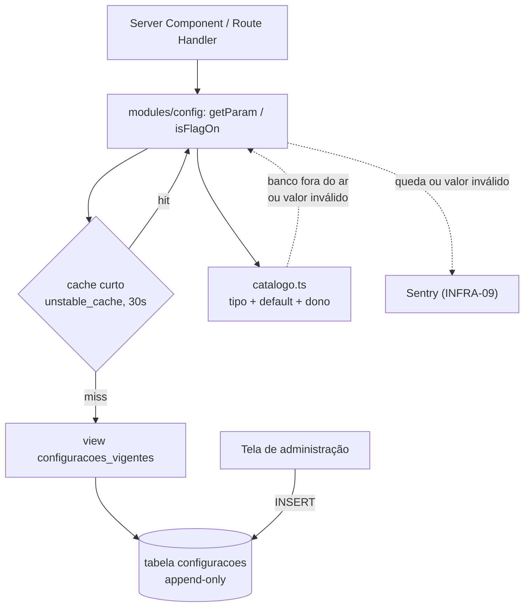

# M9 — Infra · Design

**Spec**: `.specs/modulos/m9-infra/spec.md`
**Status**: Draft
**Rodada**: 1 — cobre **INFRA-11** (configuração + feature flags) e a parte do **INFRA-04**
(particionamento de `tentativas`) que o M4 consome na primeira história.

> **Escopo desta rodada.** INFRA-01/02/03/05/06/07/09/10/12 **não** são desenhadas aqui. Cada uma
> entra em Design junto do módulo que a consome — INFRA-05 com o M2 (tutor), INFRA-12 com o M8
> (funil), INFRA-02 com o M1 (fábrica). Desenhar infra sem consumidor produz abstração que ninguém
> usa.

---

## Architecture Overview

A configuração é **uma tabela append-only** no Postgres. O valor vigente de uma chave é a **última
linha** dela. Não há UPDATE: trocar um valor é inserir uma linha nova. O histórico de "quem mudou o
quê, quando, de que valor para qual" é o próprio conteúdo da tabela, não uma tabela paralela.

Do lado da aplicação, um **catálogo em código** declara toda chave que existe: tipo, valor padrão,
módulo dono e descrição. O banco guarda **override**; o código guarda a **verdade sobre o que a
chave é**. Chave sem linha no banco vale o default do catálogo — e é assim que o sistema sobe num
banco vazio.



**Duas leituras diferentes, de propósito:**

| Leitura | Quem chama | Como |
| --- | --- | --- |
| `isFlagOn('flag.m4.simulado')` | superfície de produto | cache curto; falha ⇒ **desligada** |
| `getParam('param.m4.diagnostico_n_questoes')` | regra de negócio | cache curto; falha ⇒ default do catálogo |

A distinção existe porque o AC6 do INFRA-11 trata os dois casos de forma oposta: parâmetro ilegível
cai no default declarado, flag ilegível fica **desligada** mesmo que o default declarado seja `true`.
Flag desligada por falha nunca liga superfície sozinha.

---

## Code Reuse Analysis

Não existe código de aplicação no repositório (fase Specify encerrada, Execute não começou). Esta é
a **primeira migração** do projeto. O reuso disponível é de plataforma, não de código:

| Recurso | Onde | Como se usa | Verificado |
| --- | --- | --- | --- |
| `pg_partman` | extensão Supabase | partição mensal de `tentativas` (INFRA-04) | docs oficiais, 2026-08-16 |
| `pg_cron` | extensão Supabase | jobs leves (INFRA-03) | docs oficiais, 2026-08-16 |
| `pg_net` | extensão Supabase | **não usado nesta rodada** — registrado para o M1 | docs oficiais, 2026-08-16 |
| `unstable_cache` | `next/cache` | cache curto da leitura de config (AC5) | docs Next.js via Context7 |
| RLS do Supabase | Postgres | tabela invisível para `anon`/`authenticated` | AD-002 |

### Integration Points

| Sistema | Como conecta |
| --- | --- |
| M1…M8 | todo parâmetro marcado "em configuração" nas 8 specs vira chave do catálogo |
| Sentry (INFRA-09) | queda da leitura e valor inválido viram evento de erro |
| `docs/GITFLOW.md` | "deploy ≠ release" só é verdade porque ligar flag não passa por deploy |

---

## Components

### `configuracoes` (tabela)

- **Purpose**: guardar o valor vigente e todo o histórico de cada chave de configuração e de cada
  feature flag do projeto, em uma fonte só.
- **Location**: `supabase/migrations/` (primeira migração)
- **Dependências**: nenhuma — é a primeira tabela do schema.

### `modules/config` (leitura)

- **Purpose**: entregar valor tipado a quem consome, com cache curto e queda segura.
- **Location**: `src/modules/config/`
- **Interfaces**:
  - `getParam<K extends ChaveParam>(chave: K): Promise<TipoDe<K>>` — valor vigente ou default
  - `isFlagOn(chave: ChaveFlag): Promise<boolean>` — `false` em qualquer dúvida
  - `getParams<K extends ChaveParam[]>(...chaves: K)` — leitura em lote, um round-trip
- **Dependências**: cliente Supabase de servidor, `catalogo.ts`
- **Reusa**: `unstable_cache` do Next.js

### `modules/config/catalogo.ts`

- **Purpose**: declarar toda chave que existe — tipo, default, módulo dono, descrição. É a lista
  fechada que impede chave órfã (AC8).
- **Location**: `src/modules/config/catalogo.ts`
- **Interfaces**: `CATALOGO: Record<Chave, DefinicaoChave>` com validação por schema (`zod`)
- **Nota**: o catálogo é a **única** forma de criar chave nova. Inserir na tabela uma chave que não
  está no catálogo é erro de validação, não configuração.

### `modules/config/escrita.ts`

- **Purpose**: registrar mudança de valor com autor obrigatório.
- **Interfaces**: `setConfig(chave, valor, { autorId, motivo }): Promise<void>` — faz INSERT,
  valida contra o catálogo antes, invalida a tag de cache
- **Dependências**: sessão autenticada de administrador

---

## Data Models

### Tabela `configuracoes`

```sql
create table public.configuracoes (
  id           bigint generated always as identity primary key,
  chave        text        not null,
  valor        jsonb       not null,
  modulo_dono  text        not null,
  alterado_por uuid        not null references auth.users(id),
  motivo       text,
  alterado_em  timestamptz not null default now(),

  constraint chave_com_prefixo_valido
    check (chave ~ '^(flag|param)\.m[1-9]\.[a-z0-9_]+$')
);

-- leitura do valor vigente: última linha de cada chave
create index configuracoes_chave_recencia_idx
  on public.configuracoes (chave, alterado_em desc, id desc);

create view public.configuracoes_vigentes as
select distinct on (chave)
  chave, valor, modulo_dono, alterado_por, alterado_em
from public.configuracoes
order by chave, alterado_em desc, id desc;
```

**Por que append-only:** o AC7 exige registrar quem, quando, valor anterior e valor novo. Com
UPDATE isso obrigaria uma tabela de histórico e um gatilho que a mantém em dia — duas peças que
podem divergir. Com INSERT, o valor anterior **é** a penúltima linha: o registro não pode divergir
do fato porque é o mesmo dado. É também o padrão que o AD-015 já escolheu para `tentativas`, então
o projeto passa a ter uma regra só sobre dado que muda, e não duas. Registrado como **AD-081**.

**Sem UPDATE nem DELETE:** os mesmos `REVOKE` e o mesmo gatilho de bloqueio usados em `tentativas`
(ver design do M4) valem aqui, pelo mesmo motivo — com uma diferença: `configuracoes` **não** tem
porta de esquecimento, porque não guarda dado pessoal. `alterado_por` é o administrador, não o
aluno.

**RLS:**

```sql
alter table public.configuracoes enable row level security;
-- nenhuma policy para anon/authenticated: a tabela é invisível para o navegador.
-- toda leitura passa pelo servidor (service role), que decide o que expor.
```

Config não vai para o cliente. Algumas chaves são internas (teto de gasto do tutor, limiar de
otimização do FSRS) e não existe razão para o navegador enxergar a lista inteira para ler o preço.
O servidor lê e entrega só o que a tela precisa.

### Catálogo (TypeScript)

```typescript
type DefinicaoChave = {
  tipo: ZodTypeAny         // valida o jsonb vindo do banco
  padrao: unknown          // vale quando não há linha, ou quando a leitura falha
  moduloDono: 'm1' | 'm2' | 'm3' | 'm4' | 'm5' | 'm6' | 'm7' | 'm8' | 'm9'
  descricao: string        // aparece na tela de administração
}
```

O catálogo nasce nesta rodada com as chaves do M4 (listadas no design do M4) e cresce a cada módulo
que entra em Design. Um teste percorre a tabela e falha se existir chave no banco fora do catálogo —
é o mecanismo do AC8 ("SHALL NOT existir chave órfã").

### Particionamento de `tentativas` (INFRA-04)

```sql
create schema if not exists partman;
create extension if not exists pg_partman with schema partman;

-- a tabela é criada com "partition by range (respondida_em)" — ver design do M4
select partman.create_parent(
  p_parent_table := 'public.tentativas',
  p_control      := 'respondida_em',
  p_type         := 'range',
  p_interval     := '1 month',
  p_premake      := 3
);
```

`p_premake := 3` mantém três meses futuros pré-criados. O AC3 do INFRA-04 exige que a partição do
mês seguinte exista antes de o mês virar; três meses de folga tornam a falha da manutenção um
alerta, e não uma perda de INSERT (edge case da spec). **Partição nunca é dropada** (AD-067).

---

## Error Handling Strategy

| Cenário | Tratamento | Impacto no aluno |
| --- | --- | --- |
| Banco de config fora do ar | default do catálogo; flag ⇒ **desligada**; evento no Sentry | superfície nova não aparece; o resto funciona |
| Valor no banco não valida contra o tipo | ignora o valor, usa o default, **alerta** | nenhum |
| Chave lida não está no catálogo | erro em tempo de compilação (tipo) ou exceção | nenhum — não chega em produção |
| INSERT com `alterado_por` nulo | recusado pelo `not null` | n/a — é operação interna |
| Cache servindo valor velho | dura no máximo a janela (30s) | flag demora até 30s para valer |

---

## Risks & Concerns

| Concern | Onde | Impacto | Mitigação |
| --- | --- | --- | --- |
| Leitura de flag entra no caminho da requisição e vira ponto quente | `modules/config` | latência em toda página | cache curto obrigatório (AC5) + leitura em lote; o AD-078 já registrou o trade-off |
| **Circularidade**: a janela de cache não pode morar na própria tabela cacheada | `modules/config` | valor novo nunca chegaria se o TTL estivesse errado no banco | TTL é **constante em código** (30s), documentado aqui; é a única exceção declarada ao "tudo em configuração" |
| Config não aparece no diff do git | operação | ninguém revisa mudança de preço como revisa código | `alterado_por` + `motivo` obrigatórios na prática; tela de administração mostra o histórico da chave |
| Tabela cresce para sempre (append-only) | `configuracoes` | irrelevante — dezenas de chaves × poucas mudanças/ano | nenhuma; se um dia incomodar, arquiva linhas antigas sem apagar a vigente |
| `pg_partman` é extensão de terceiro na infra gerenciada | migração | manutenção pode não rodar | `p_premake := 3` dá 3 meses de folga + alerta (INFRA-09) |
| Nenhum teste de integração existe ainda | projeto inteiro | o primeiro consumidor da config é também o primeiro teste | as tasks desta feature incluem o teste do fallback (banco fora ⇒ flag desligada) |

---

## Tech Decisions

| Decisão | Escolha | Racional |
| --- | --- | --- |
| Formato da tabela | **append-only**, valor vigente = última linha | AC7 sai de graça e não pode divergir do fato; mesmo padrão do AD-015 → **AD-081** |
| Flags e parâmetros | **mesma tabela**, separados por prefixo `flag.` / `param.` | AC1 exige uma fonte só; o prefixo dá a distinção sem uma segunda tabela |
| Tipo da coluna de valor | `jsonb` | um parâmetro é número, outro é objeto de faixas (FSRS); o tipo real é validado pelo catálogo |
| Janela de cache | **constante em código**, 30s | não pode morar na tabela que ela mesma cacheia |
| Visibilidade | RLS fecha para o navegador; leitura só no servidor | chave interna não deve trafegar para o cliente |
| Nome das tabelas | PT-BR (`configuracoes`) | AGENTS.md: banco em PT-BR; código utilitário (`modules/config`) em inglês |

> **AD nova desta rodada:** **AD-081** (formato append-only + contrato de leitura). Registrada em
> `.specs/STATE.md`.
